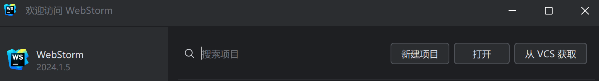
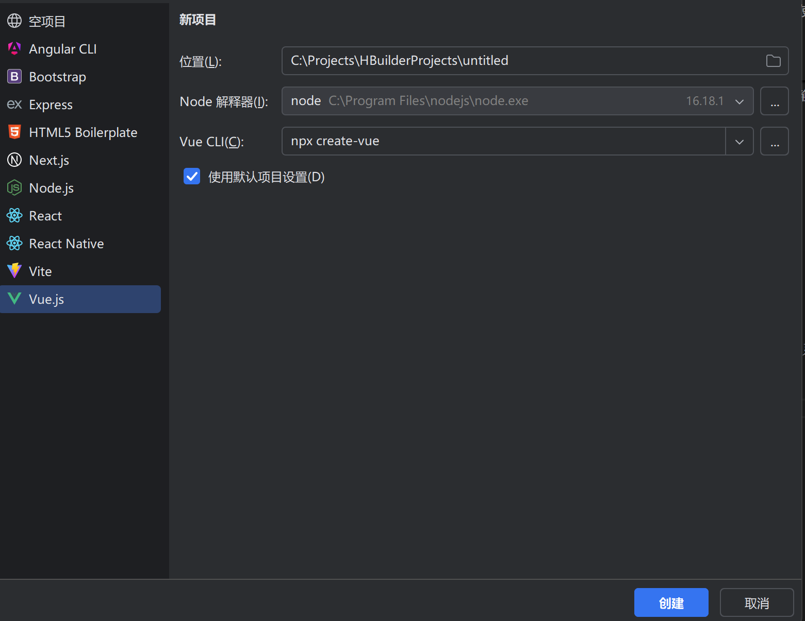
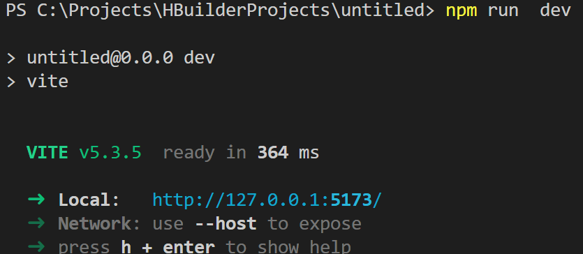
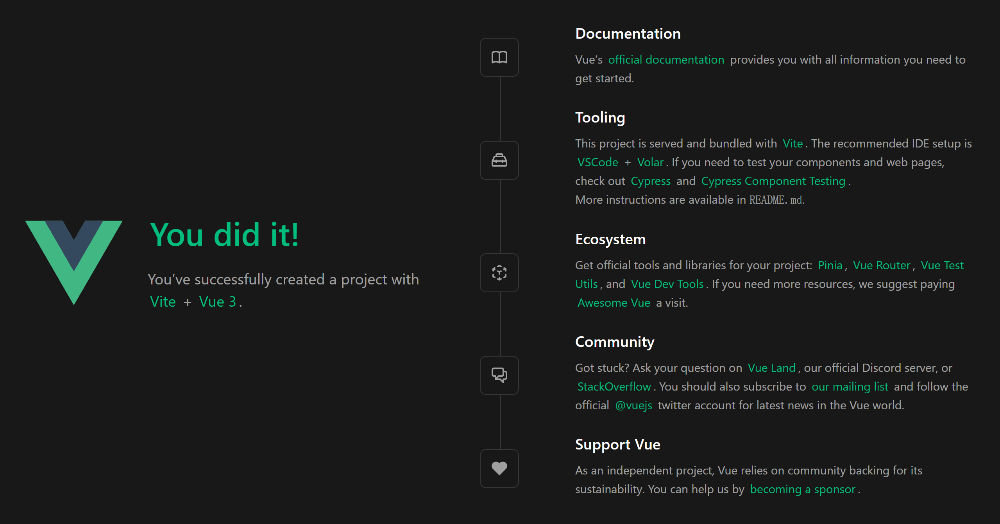
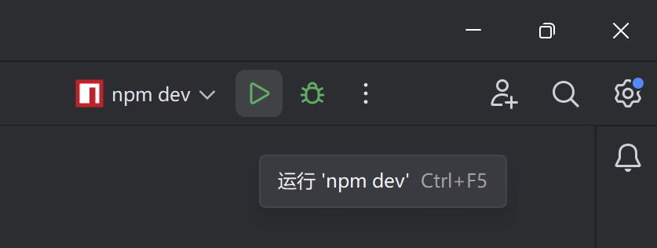

# iOS Club和你一起学Vue（1）

> 事实上的确，Vue是一个非常优秀的前端框架。它可以让一个新手在短时间内开发出一个像样的产品。
>
> 这次我们就来学习Vue这一前端开发利器

## 什么是Vue

**Vue**是一个轻量级但功能强大的前端框架，专注于视图层，易于上手并具有高度可组合性。

当前的最新版本是3，我们这次的教学也是教Vue 3。

### 特点

* **声明式渲染** ：Vue 使用声明式的编程方式来描述 UI 的状态，使得开发者能够更直观地理解和维护代码。
* **组件化架构** ：Vue 支持组件化的开发模式，允许开发者将 UI 分解成可复用的组件。
* **响应式系统** ：Vue 内置了一个高效的响应式系统，能够自动追踪数据变化并更新 DOM。
* **灵活性** ：Vue 可以作为一个简单的库来增强现有项目，也可以作为构建复杂单页应用的基础框架。

我们在之后都会一一讲到。

### 怎样才能开发Vue？

要创建一个Vue项目，需要安装Node.js和Vue CLI。

### 1. 安装 Node.js

* **下载** : 访问 [Node.js 官方网站](https://nodejs.org/) 下载适用于你的操作系统的 Node.js 版本。
* **安装** : 根据安装向导完成安装。

### 2. 安装 Vue CLI

* **全局安装** : 在命令行中运行以下命令：

```shell
npm install -g @vue/cli
```

现在，我们已经把环境给安装好了，是时候选择一个合适的编程开发工具了！

## 选择一个合适的编程开发工具

在开发Vue的时候，我们通常会考虑以下两个工具:

- **Visual Studio Code (VS Code)** : 这是一个开源的代码编辑器，支持 Vue.js 开发。VS Code 是一个功能强大的代码编辑器，具有丰富的插件支持，可以满足开发 Vue.js 应用的需求。
- **WebStorm** : 这是一个商业的 IDE，支持 Vue.js 开发。WebStorm 是一个功能强大的 IDE，具有丰富的插件支持，可以满足开发 Vue.js 应用的需求。

现在我们来分别进行介绍：

### 使用VS Code进行开发

- **安装** : 访问 [VS Code 官网](https://code.visualstudio.com/) 下载适用于你的操作系统的 VS Code 版本。
- **安装必要的扩展** :

  - Vue.js 插件: 安装 Vetur，这是 VS Code 中最常用的 Vue.js 支持插件。

    打开 VS Code，点击左侧边栏的 Extensions 图标 (Extensions: Extensions)。在搜索框中输入 Vetur 并安装。
  - 其他推荐插件:

    - Prettier: 代码格式化工具。
    - ESLint: 代码质量检查工具。
    - Path Intellisense: 自动补全文件路径。
    - Auto Rename Tag: 自动重命名 HTML/XML 标签。
    - Live Server: 快速预览 HTML 页面。

### 使用WebStorm进行开发

- **安装** : 访问 [WebStorm 官网](https://www.jetbrains.com/webstorm/) 下载适用于你的操作系统的 WebStorm 版本。

1. **打开WebStorm，并新建一个项目** :



2. **选择Vue.js，并输入项目名称** :



3. **新建好之后记得运行npm install,方便引入依赖包**

现在，我们已经准备好开发Vue了！

## Vue的项目架构

当我们来到文件这一栏的时候，应该都会有点懵。那么下面我们就来简单讲一下Vue的项目架构:

1. src 目录
   一般来说，src 目录是项目的主要源代码存放位置:
   子目录:
   - assets文件夹: 存放静态资源，如图片、字体等。
   - components: 存放可复用的 Vue 组件。
   - app.vue: 应用的根组件。
   - main.js 或 main.ts: 应用的入口文件。
2. public 目录
   我们会存放不需要被 webpack 处理的静态文件，如 favicon.ico 或 index.html。

剩下的文件基本上都是配置文件，我们暂时先不关心。

## 来运行一下我们的项目吧

我们这里分软件来运行我们的项目：

### VS Code

我们来打开VS Code，打开我们的项目，然后运行 `npm run dev `：



现在就可以来玩了，我们打开浏览器，输入 `[http://127.0.0.1:5174/](http://127.0.0.1:5174/)`，就可以看到我们的项目了：



### WebStorm

直接点击运行按钮即可：



现在，我们已经准备好开发Vue了！