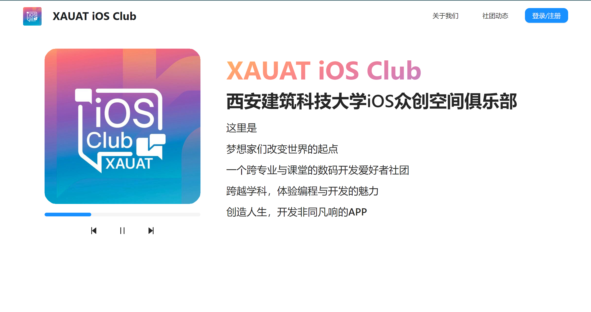
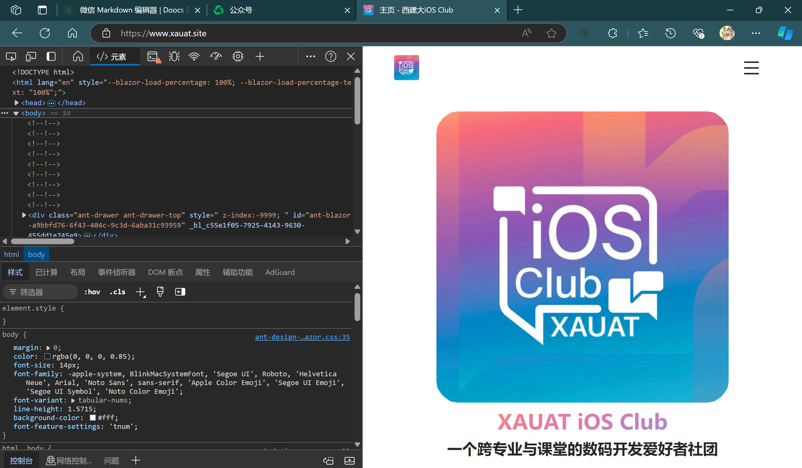
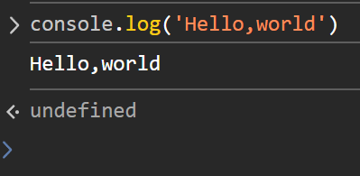
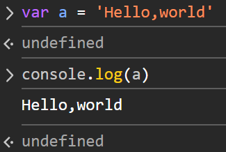
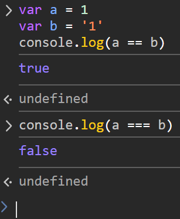
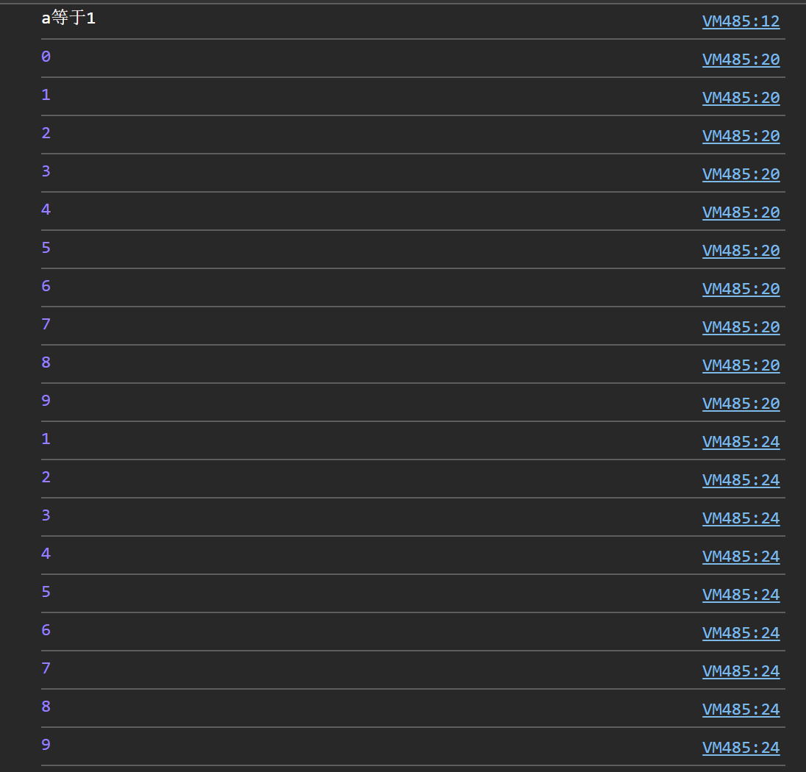
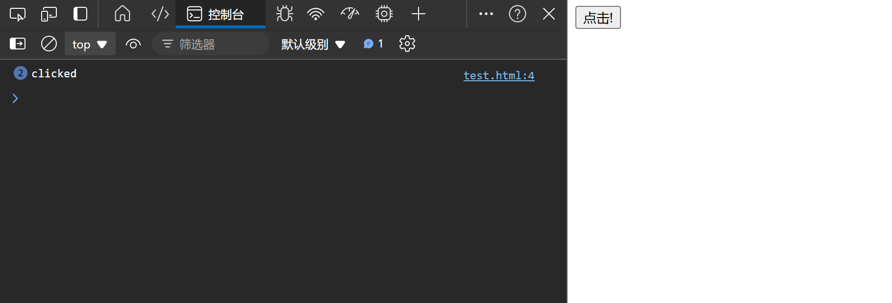
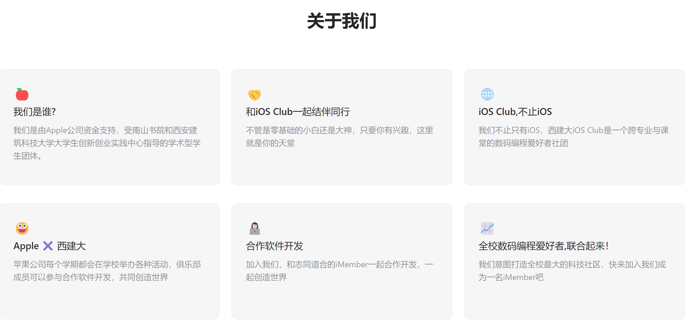

# iOS Club和你一起学Vue（3）简单学习JS

> 我们在上一期学习了Html和Css这两个语言，他们都比较的简单
>
> 我们这一期来讲JS，不过JS我们得分好几节讲

对于最开始的网页，他只有HTML这种，也就是说他完全是静态的，就是一个超级文章而已。但是后面我们发现我们下的软件实在是太多了，可是很多的内容其实根本就不需要在本地，就比如说官网或者小说集。既然是完完全全在网上就可以直接使用的，为什么我们还要在本地运行呢？

于是在这种情况下，我们就产生了这样的需求：我们需要能让界面动起来，需要进行大量的操作。

这个时候我们就需要像本地一样，需要写一些事件，或者说我们得写一些逻辑才行了。

是的，Js诞生了。

## JS是什么

**JavaScript**是一种广泛使用的编程语言，具有以下特点：

* **轻量级** ：它不需要复杂的编译过程，可以直接嵌入到 HTML 文档中运行。
* **解释型** 或  **即时编译型** ：代码可以被 JavaScript 引擎直接执行，无需预先编译成机器码。
* **高级语言** ：它提供了高级抽象，使得开发者可以更容易地编写程序。
* **基于原型** ：JavaScript 支持面向对象编程，但与传统的类继承不同，它使用基于原型的继承机制。
* **动态类型** 和  **弱类型** ：变量可以在运行时改变类型，并且类型检查相对宽松。
* **事件驱动** ：JavaScript 常用于处理用户交互，如点击按钮或滚动页面等事件。

JavaScript 主要用于 Web 开发，可以在浏览器端执行，为静态 HTML 页面添加动态功能，如表单验证、动画效果、数据处理等。

我们甚至可以在浏览器上面直接写JS代码。因为浏览器为了支持JS，直接自带了一个控制台和JS引擎。

我们现在可以打开任何一个网站，就比如说[iOS Club社团官网](https:/www.xauat.site):



按住F12键，就可以打开开发工具了。当然你有可能会遇到打不开的情况，这个时候请按一下Fn+F12（FN一般在笔记本键盘的左下角）。



然后点击控制台，我们就可以写第一个代码了。

```js
console.log("Hello World")
```

直接回车，我们就可以看到了



当然一个语句的末尾也可以打一个分号，这都没有什么影响。

```js
console.log("Hello World");
```

这样也可以运行。

## 使用变量来存储数据

如果各位在使用官网的时候，点击那个快进键会发现右边的文字会发生变动，再按一下就会回来。这是怎么做到的。

很简单，我们从一开始就存储了一些数据，每当进行点击的时候，就会让文字发生变动。

那么我们如何存储数据呢？我们可以使用变量来存储数据。

```js
var a = "Hello World"
console.log(a)
```

我们这里创建了一个变量名为a，然后我们给a赋值了"Hello World"，然后我们打印了a，我们就可以看到了。

如下图：



当然我们还可以创建其他类型的变量：

- **number** : 数字类型，如 3、3.14、-5 等。
- **string** : 字符串类型，如 "Hello World"、'Hello World' 等（双引号单引号都可以）。
- **boolean** : 布尔类型，只有两个值 true 和 false。
- **array** : 数组类型，如 [1, 2, 3]。
- **null** : 空值类型，表示一个空值。

我们现在可以一一创建一下：

```js
var a = "Hello World"
var b = 3
var c = true
var d = [1, 2, 3]
var e = null
console.log(a, b, c, d, e)
// Hello World 3 true 1,2,3 null
```

事实上光有变量还不够，我们有很多时候，变量要显示的是动态的，可以被更改的。所以我们需要对变量进行处理。

## 运算

假使我们的老板想把我们的计算器应用给搬到网上，想写一个简单的计算器网站，这个时候我们就需要使用运算符了。

运算符是 JavaScript 中最基本的运算符，用于执行基本的数学运算。以下是 JavaScript 中常用的运算符：

* **算术运算符** ：如 `+`, `-`, `*`, `/`, `%`。
* **比较运算符** ：如 `==`, `===`, `!=`, `!==`, `<`, `>`, `<=`, `>=`。
* **逻辑运算符** ：如 `&&`, `||`, `!`。
* **赋值运算符** ：如 `=`, `+=`, `-=`, `*=`, `/=`。

当然我这里特别强调，尽量不要使用 `==` ，尤其是不懂这个东西的魔幻程度的人。

我们来看一下：

```js
var a = 1
var b = '1'
console.log(a == b)
// true
console.log(a === b)
// false
```



对于两个不同类型的变量，理论上不应该相等，但是这里的 == 却让他相等了。所以请注意，在JS中对应其他语言的 == 的是 **===** 而不是 ==

## 语句

语句是 JavaScript 中最基本的组成单位，用于执行特定的操作。以下是 JavaScript 中常用的语句：

* **if 语句** ：用于根据条件执行代码。
* **switch 语句** ：用于根据条件执行不同的代码块。
* **for 语句** ：用于循环执行代码。
* **while 语句** ：用于循环执行代码。

我们现在来试一下：

```js
var a = 1
if (a === 1) {
    console.log("a等于1")
}else if(a == '2') {
    console.log("a等于2")
}else {
    console.log("a不等于1")
}

switch (a) {
    case 1:
        console.log("a等于1")
        break
    default:
        console.log("a不等于1")
        break
}

for (var i = 0; i < 10; i++) {
    console.log(i)
}

while (a < 10) {
    console.log(a)
    a++
}
```

我们现在可以看一下：



我们可以发现，if 语句和 switch 语句都可以实现条件判断，for 语句和 while 语句都可以实现循环。

## 函数

函数是 JavaScript 中最基本的组成单位，用于执行特定的操作。我们基本上都会使用到函数进行事件的书写。就比如说我们现在可以写一个：

```html
<button onclick="asdf()">点击!</button>
<script>
    function asdf() {
        console.log("clicked");
    }
</script>
```

我们可以发现，当我们点击按钮的时候，就会打印出clicked。



我们也可以设置一个返回值，使用return语句：

```js
function asdf() {
    return "clicked";
    console.log("clicked");
}
```

我们在使用这个函数的时候会发现我们什么都没有打印出来，因为return语句会直接返回值，然后后面的代码就不会执行了。

## 数组

我们在很多的时候会发现要在界面上显示许多内容，就比如：



在这里我们会发现我们显示了6个卡片，而这6个卡片事实上并不是我直接使用Html写的，而是动态生成的。

这里就需要用到数组了。

一般来说一个数组长这个样子：

```js
var arr = [1, 2, 3, 4, 5, 6]
console.log(arr[0])
// 1
```

当然我们也可以对这个数据进行增删改查等操作：

```js
var arr = [1, 2, 3, 4, 5, 6]
arr.push(7) // 添加元素
console.log(arr)
// [1, 2, 3, 4, 5, 6, 7]
arr.pop() // 删除元素
console.log(arr)
// [1, 2, 3, 4, 5, 6]
arr.shift() // 删除第一个元素
console.log(arr)
// [2, 3, 4, 5, 6]
arr.unshift(1) // 添加元素
console.log(arr)
// [1, 2, 3, 4, 5, 6]
console.log(arr.length)
// 6
console.log(arr[1])
// 2
arr[1] = 3
console.log(arr[1])
// 3
```

## 对象

但是我们现在有一个问题，我们已经创建好了数组，但是我们这次要显现的有三种元素，标题，图像（emoji），和描述。

那我们该怎么样才可以去显示呢？

我们可以使用对象来存储我们的数据：

```js
var obj = {
    title: "标题",
    image: "emoji",
    description: "描述"
}
console.log(obj.title)
// 标题
console.log(obj.image)
// emoji
console.log(obj.description) 
// 描述
console.log(obj["title"]) // 或者我们可以使用[]来查询元素
```

我们使用{}来创建一个对象，每个对象都会有属性。

## 上次的练习答案

* 创建一个简单的 HTML 页面，包含一个标题、一个段落和一个按钮。
* 写一个卡片，要求使用到圆角，当其悬停时，其边框显现，并且是蓝色的

1. HTML 页面：

```html
<!DOCTYPE html>
<html>
    <head>
        <title>卡片</title>
    </head>
    <body>
        <h1 id="title">标题</h1>
        <p id="description">描述</p>
        <button id="button">按钮</button>
    </body>
</html>
```

2. 卡片：

```html
<div class="card">
    <p>内容</p>
</div>

<style>
.card {
    border: 1px solid #ccc;
    border-radius: 5px;
}

.card:hover {
    border: 1px solid blue;
}
</style>

```

## 练习

当点击按钮的时候，按钮里头的文本就加1

## 结尾

这个就是JavaScript的基础知识了。

下节课我们正式开始学习Vue